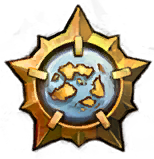

<p align="center">

<h1 align="center">Guild Wars 2 Geo Guesser</h1>
</p>

## Background

Inspired by watching [PointCrow play HyruleGuesser](https://www.youtube.com/watch?v=8OVelEkMBxA), with [HyruleGuesser](https://hyruleguessr.com/) being inspired by [Geoguessr](https://www.geoguessr.com/).

The idea is that you get shown an image from somewhere in Guild Wars 2, and then have to guess on a map where the picture was taken. You get points based on how close your guess is to the real location.

## Development

```sh
git clone git@github.com:maael/gw2-geoguesser.git
cd gw2-geoguesser
yarn
yarn dev
```

## Design Thoughts

### Technologies

- MongoDB
- Next.js
  - Hosted on Vercel

### Account / Users

Considered using Discord / Reddit accounts, but users may not want to use them, and also Discord linked accounts have issues with keeping the display pictures up to date (the display pictures go after an amount of time, seen on past projects).

Taking a note from Hyrule Guesser, we'll roll our own minimal user/password system here. We don't need it to be anything super deluxe. Display pictures will be generated things too, similar to Hyrule Guesser. Maybe commission so basic SVG parts that we can mix together for the different races some time or something.

### Data Collection

Images and locations are collected using the [Guild Wars 2 Sightseeing App here](https://github.com/maael/gw2-sightseeing). This makes it easy to collect the images and game locations required.

### Tiles / Game Locations

Using the official game [Tile Service](https://wiki.guildwars2.com/wiki/API:Tile_service) doesn't seem to work well, the locations are off and locations like the End of Dragons tiles and Drizzlewood are missing, which is less than ideal.

An example was provided in the GW2 API Developers discord used by the TINY guild, and plugging in their Tile Service solved all location issues instantly with no other work. Their tiles are provided by that_shaman.

> **Note**
> Todo: Create own Tile Service so we're not leeching off the TINY service and causing them more load.

### Messaging

#### Winner Message

```
Hey there!

You were chosen as the lucky winner of the entry lottery for Guild Wars 2 Geoguesser's [name] ranked game.

Thanks for playing!
```
